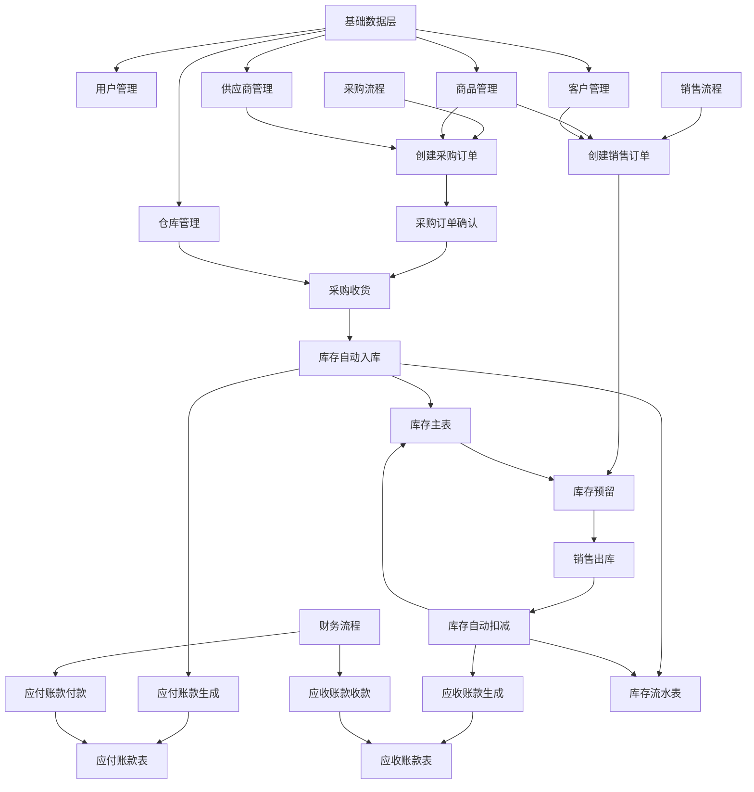
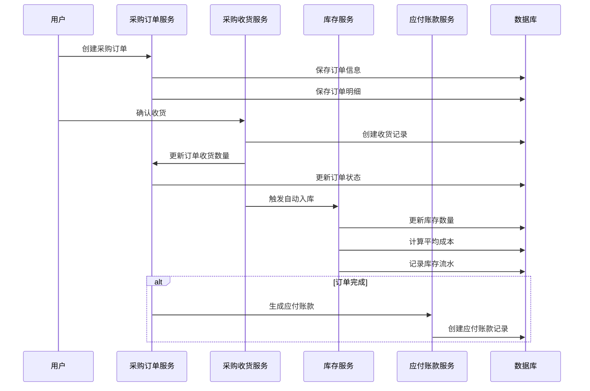
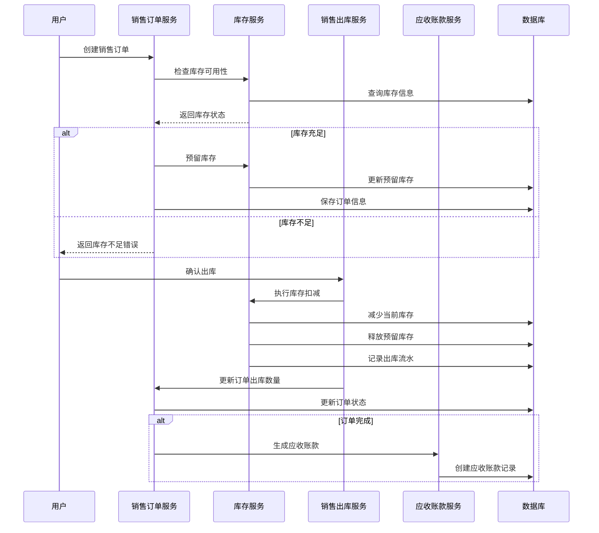
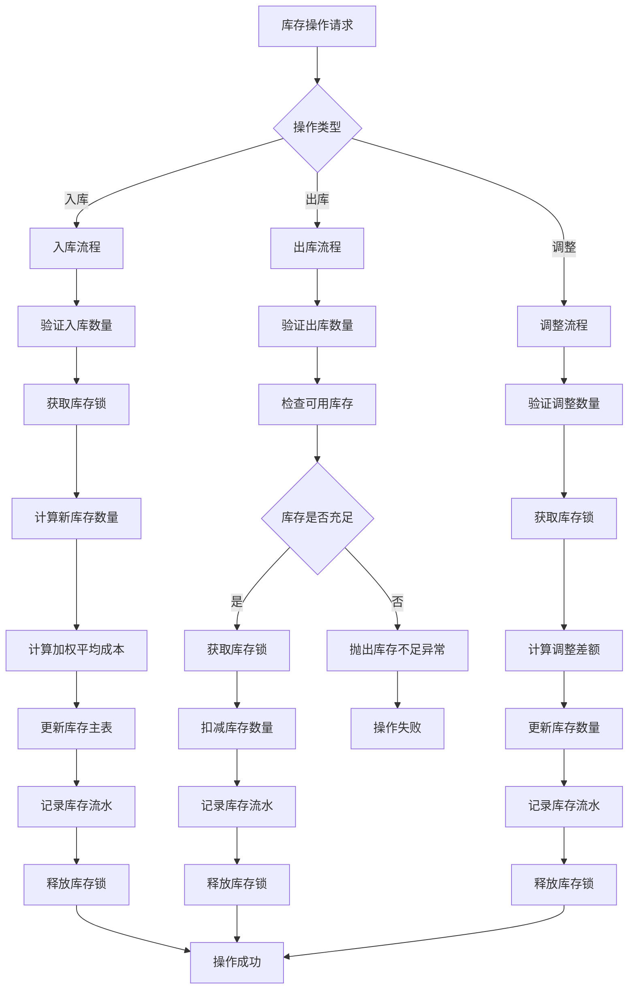
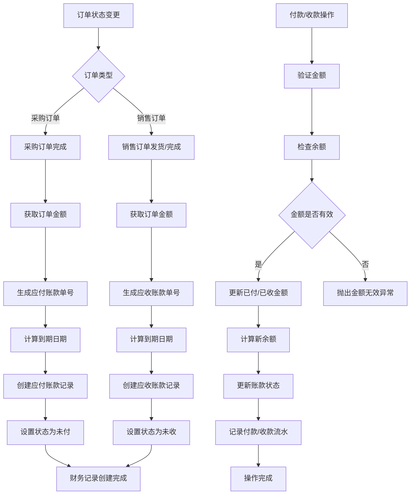
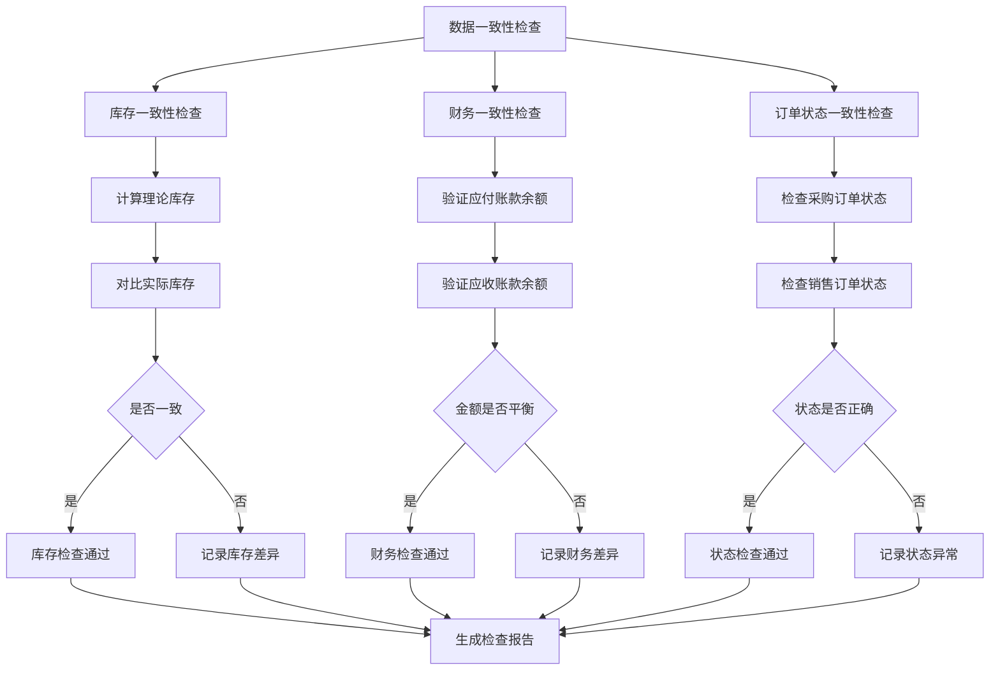
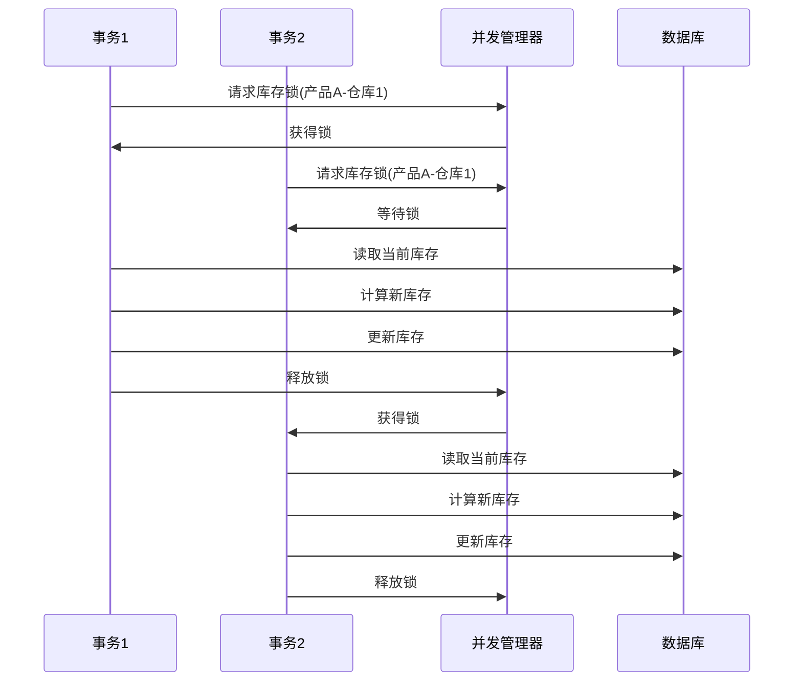
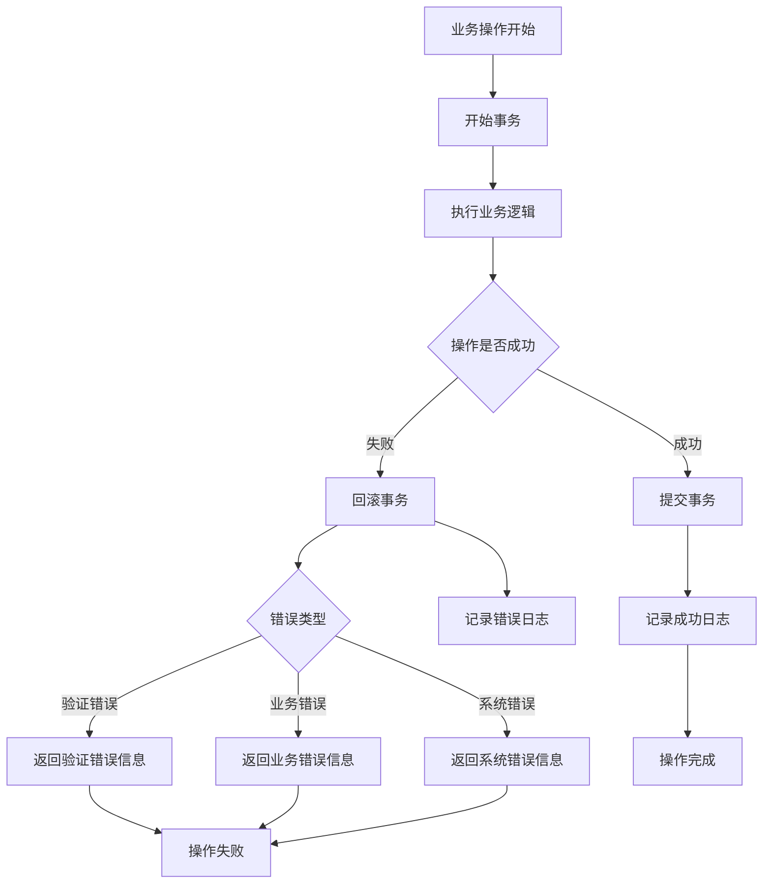

# 进销存系统数据流程图

## 完整业务流程图

```mermaid
graph TD
    %% 基础数据层
    A[基础数据层] --> A1[用户管理]
    A --> A2[商品管理]
    A --> A3[供应商管理]
    A --> A4[客户管理]
    A --> A5[仓库管理]
    
    %% 采购流程
    B[采购流程] --> B1[创建采购订单]
    B1 --> B2[采购订单确认]
    B2 --> B3[采购收货]
    B3 --> B4[库存自动入库]
    B4 --> B5[应付账款生成]
    
    %% 销售流程
    C[销售流程] --> C1[创建销售订单]
    C1 --> C2[库存预留]
    C2 --> C3[销售出库]
    C3 --> C4[库存自动扣减]
    C4 --> C5[应收账款生成]
    
    %% 财务流程
    D[财务流程] --> D1[应付账款付款]
    D --> D2[应收账款收款]
    
    %% 数据流向
    A2 --> B1
    A3 --> B1
    A5 --> B3
    B4 --> E[库存主表]
    
    A2 --> C1
    A4 --> C1
    E --> C2
    C4 --> E
    
    B5 --> F[应付账款表]
    C5 --> G[应收账款表]
    D1 --> F
    D2 --> G
    
    %% 库存流水
    B4 --> H[库存流水表]
    C4 --> H
```

## 详细采购流程图

```mermaid
sequenceDiagram
    participant U as 用户
    participant PO as 采购订单服务
    participant PR as 采购收货服务
    participant IS as 库存服务
    participant AP as 应付账款服务
    participant DB as 数据库
    
    U->>PO: 创建采购订单
    PO->>DB: 保存订单信息
    PO->>DB: 保存订单明细
    
    U->>PR: 确认收货
    PR->>DB: 创建收货记录
    PR->>PO: 更新订单收货数量
    PO->>DB: 更新订单状态
    
    PR->>IS: 触发自动入库
    IS->>DB: 更新库存数量
    IS->>DB: 计算平均成本
    IS->>DB: 记录库存流水
    
    alt 订单完成
        PO->>AP: 生成应付账款
        AP->>DB: 创建应付账款记录
    end
```

## 详细销售流程图

```mermaid
sequenceDiagram
    participant U as 用户
    participant SO as 销售订单服务
    participant IS as 库存服务
    participant SD as 销售出库服务
    participant AR as 应收账款服务
    participant DB as 数据库
    
    U->>SO: 创建销售订单
    SO->>IS: 检查库存可用性
    IS->>DB: 查询库存信息
    IS-->>SO: 返回库存状态
    
    alt 库存充足
        SO->>IS: 预留库存
        IS->>DB: 更新预留库存
        SO->>DB: 保存订单信息
    else 库存不足
        SO-->>U: 返回库存不足错误
    end
    
    U->>SD: 确认出库
    SD->>IS: 执行库存扣减
    IS->>DB: 减少当前库存
    IS->>DB: 释放预留库存
    IS->>DB: 记录出库流水
    
    SD->>SO: 更新订单出库数量
    SO->>DB: 更新订单状态
    
    alt 订单完成
        SO->>AR: 生成应收账款
        AR->>DB: 创建应收账款记录
    end
```

## 库存操作流程图

```mermaid
flowchart TD
    A[库存操作请求] --> B{操作类型}
    
    B -->|入库| C[入库流程]
    B -->|出库| D[出库流程]
    B -->|调整| E[调整流程]
    
    C --> C1[验证入库数量]
    C1 --> C2[获取库存锁]
    C2 --> C3[计算新库存数量]
    C3 --> C4[计算加权平均成本]
    C4 --> C5[更新库存主表]
    C5 --> C6[记录库存流水]
    C6 --> C7[释放库存锁]
    
    D --> D1[验证出库数量]
    D1 --> D2[检查可用库存]
    D2 --> D3{库存是否充足}
    D3 -->|是| D4[获取库存锁]
    D3 -->|否| D8[抛出库存不足异常]
    D4 --> D5[扣减库存数量]
    D5 --> D6[记录库存流水]
    D6 --> D7[释放库存锁]
    
    E --> E1[验证调整数量]
    E1 --> E2[获取库存锁]
    E2 --> E3[计算调整差额]
    E3 --> E4[更新库存数量]
    E4 --> E5[记录库存流水]
    E5 --> E6[释放库存锁]
    
    C7 --> F[操作成功]
    D7 --> F
    E6 --> F
    D8 --> G[操作失败]
```

## 财务集成流程图

```mermaid
flowchart TD
    A[订单状态变更] --> B{订单类型}
    
    B -->|采购订单| C[采购订单完成]
    B -->|销售订单| D[销售订单发货/完成]
    
    C --> C1[获取订单金额]
    C1 --> C2[生成应付账款单号]
    C2 --> C3[计算到期日期]
    C3 --> C4[创建应付账款记录]
    C4 --> C5[设置状态为未付]
    
    D --> D1[获取订单金额]
    D1 --> D2[生成应收账款单号]
    D2 --> D3[计算到期日期]
    D3 --> D4[创建应收账款记录]
    D4 --> D5[设置状态为未收]
    
    C5 --> E[财务记录创建完成]
    D5 --> E
    
    %% 付款收款流程
    F[付款/收款操作] --> F1[验证金额]
    F1 --> F2[检查余额]
    F2 --> F3{金额是否有效}
    F3 -->|是| F4[更新已付/已收金额]
    F3 -->|否| F7[抛出金额无效异常]
    F4 --> F5[计算新余额]
    F5 --> F6[更新账款状态]
    F6 --> F8[记录付款/收款流水]
    F8 --> F9[操作完成]
```

## 数据一致性检查流程图

```mermaid
flowchart TD
    A[数据一致性检查] --> B[库存一致性检查]
    A --> C[财务一致性检查]
    A --> D[订单状态一致性检查]
    
    B --> B1[计算理论库存]
    B1 --> B2[对比实际库存]
    B2 --> B3{是否一致}
    B3 -->|是| B4[库存检查通过]
    B3 -->|否| B5[记录库存差异]
    
    C --> C1[验证应付账款余额]
    C1 --> C2[验证应收账款余额]
    C2 --> C3{金额是否平衡}
    C3 -->|是| C4[财务检查通过]
    C3 -->|否| C5[记录财务差异]
    
    D --> D1[检查采购订单状态]
    D1 --> D2[检查销售订单状态]
    D2 --> D3{状态是否正确}
    D3 -->|是| D4[状态检查通过]
    D3 -->|否| D5[记录状态异常]
    
    B4 --> E[生成检查报告]
    B5 --> E
    C4 --> E
    C5 --> E
    D4 --> E
    D5 --> E
```

## 并发控制流程图

```mermaid
sequenceDiagram
    participant T1 as 事务1
    participant T2 as 事务2
    participant CM as 并发管理器
    participant DB as 数据库
    
    T1->>CM: 请求库存锁(产品A-仓库1)
    CM->>T1: 获得锁
    
    T2->>CM: 请求库存锁(产品A-仓库1)
    CM->>T2: 等待锁
    
    T1->>DB: 读取当前库存
    T1->>DB: 计算新库存
    T1->>DB: 更新库存
    T1->>CM: 释放锁
    
    CM->>T2: 获得锁
    T2->>DB: 读取当前库存
    T2->>DB: 计算新库存
    T2->>DB: 更新库存
    T2->>CM: 释放锁
```

## 错误处理流程图

```mermaid
flowchart TD
    A[业务操作开始] --> B[开始事务]
    B --> C[执行业务逻辑]
    C --> D{操作是否成功}
    
    D -->|成功| E[提交事务]
    D -->|失败| F[回滚事务]
    
    E --> G[记录成功日志]
    F --> H[记录错误日志]
    
    F --> I{错误类型}
    I -->|验证错误| J[返回验证错误信息]
    I -->|业务错误| K[返回业务错误信息]
    I -->|系统错误| L[返回系统错误信息]
    
    G --> M[操作完成]
    J --> N[操作失败]
    K --> N
    L --> N
```
