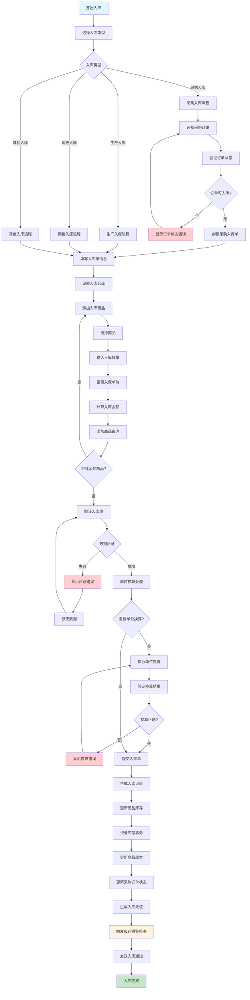
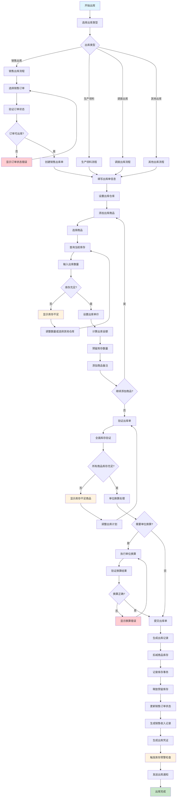
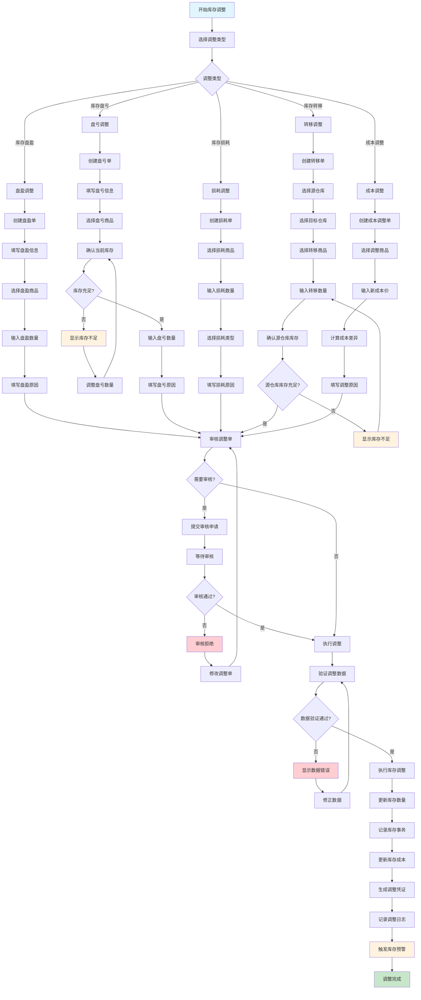
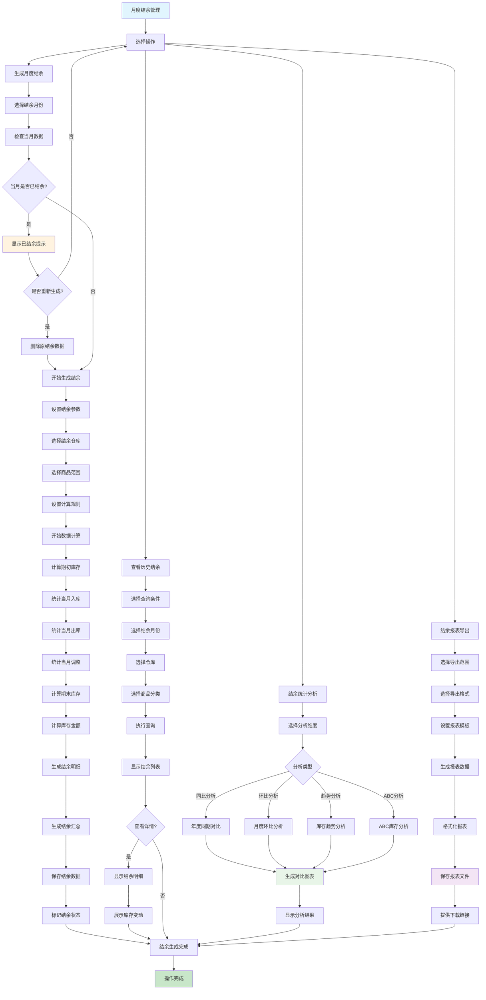
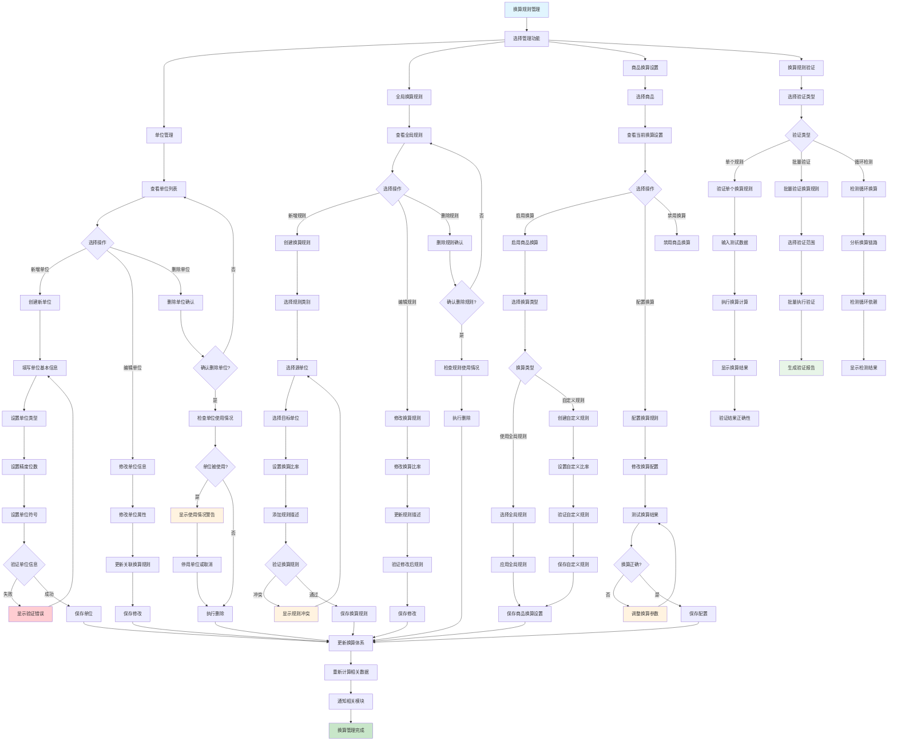
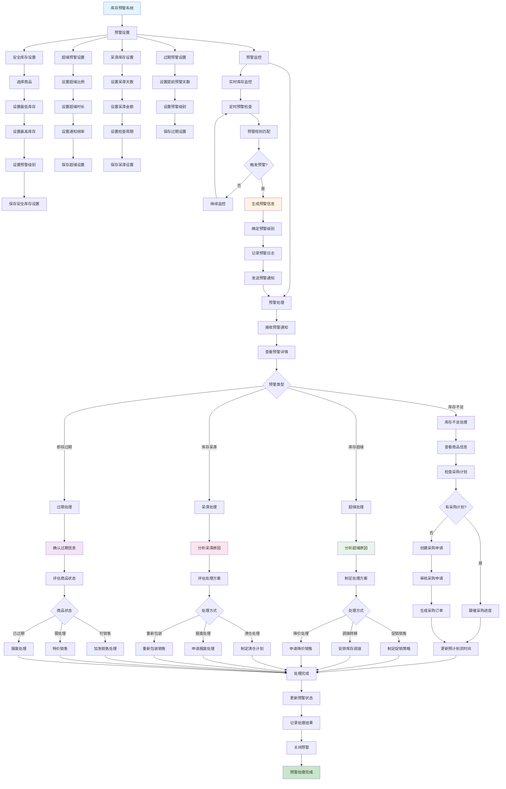
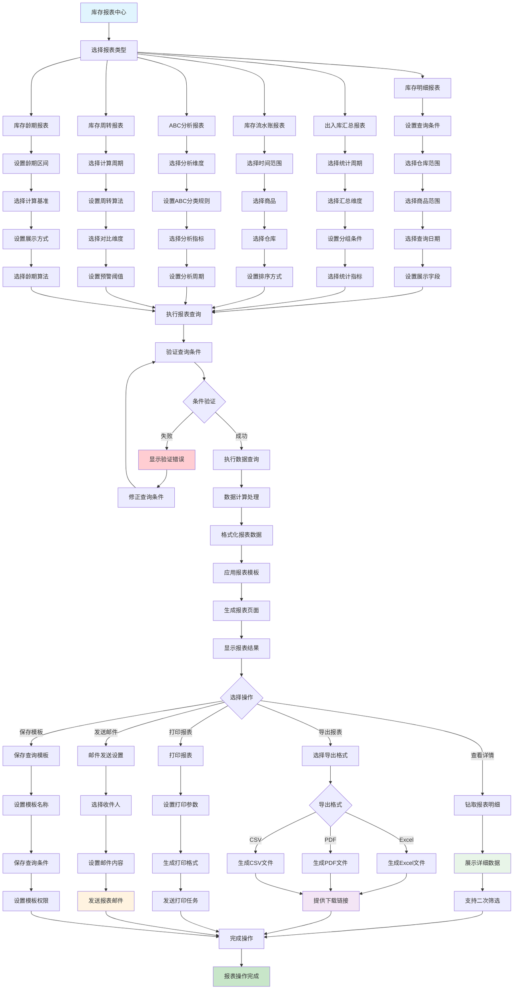
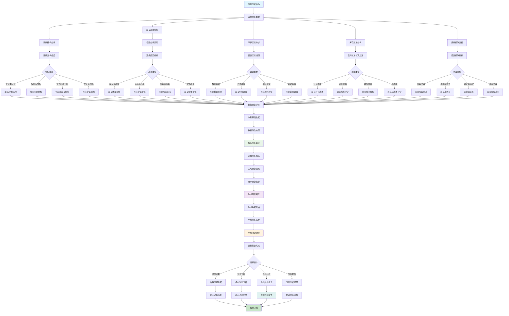

# 库存管理系统 - 详细流程图

> 本文档专门针对库存管理模块的所有业务流程，包含入库、出库、库存调整、月度结余、换算规则管理以及各种报表生成流程。

## 目录

1. [库存管理主流程图](#1-库存管理主流程图)
2. [入库管理流程图](#2-入库管理流程图)
3. [出库管理流程图](#3-出库管理流程图)
4. [库存调整流程图](#4-库存调整流程图)
5. [月度结余流程图](#5-月度结余流程图)
6. [单位换算规则管理流程图](#6-单位换算规则管理流程图)
7. [库存盘点流程图](#7-库存盘点流程图)
8. [库存预警流程图](#8-库存预警流程图)
9. [库存报表生成流程图](#9-库存报表生成流程图)
10. [库存分析报表流程图](#10-库存分析报表流程图)

---

## 1. 库存管理主流程图

库存管理模块的总体业务流程概览，展示各个子功能模块之间的关系和数据流向。

```mermaid
flowchart TD
    A[库存管理系统] --> B[选择管理功能]
    
    B --> C[入库管理]
    B --> D[出库管理]
    B --> E[库存调整]
    B --> F[库存盘点]
    B --> G[月度结余]
    B --> H[库存预警]
    B --> I[库存报表]
    B --> J[换算规则管理]
    
    %% 入库管理
    C --> C1[采购入库]
    C --> C2[生产入库]
    C --> C3[其他入库]
    C --> C4[退货入库]
    
    %% 出库管理
    D --> D1[销售出库]
    D --> D2[生产领料]
    D --> D3[其他出库]
    D --> D4[调拨出库]
    
    %% 库存调整
    E --> E1[库存盘盈]
    E --> E2[库存盘亏]
    E --> E3[库存损耗]
    E --> E4[库存转移]
    
    %% 库存盘点
    F --> F1[全盘盘点]
    F --> F2[循环盘点]
    F --> F3[抽样盘点]
    F --> F4[ABC分类盘点]
    
    %% 月度结余
    G --> G1[月度结余生成]
    G --> G2[结余数据查看]
    G --> G3[结余统计分析]
    G --> G4[历史结余对比]
    
    %% 库存预警
    H --> H1[安全库存预警]
    H --> H2[超储预警]
    H --> H3[呆滞库存预警]
    H --> H4[即将过期预警]
    
    %% 库存报表
    I --> I1[库存明细表]
    I --> I2[出入库汇总表]
    I --> I3[库存流水账]
    I --> I4[ABC分析报表]
    I --> I5[库存周转分析]
    
    %% 换算规则管理
    J --> J1[单位管理]
    J --> J2[换算规则设置]
    J --> J3[商品换算配置]
    J --> J4[换算规则验证]
    
    %% 数据流向
    C1 --> K[更新库存数据]
    C2 --> K
    C3 --> K
    C4 --> K
    D1 --> K
    D2 --> K
    D3 --> K
    D4 --> K
    E1 --> K
    E2 --> K
    E3 --> K
    E4 --> K
    
    K --> L[触发库存预警检查]
    L --> H1
    L --> H2
    L --> H3
    L --> H4
    
    K --> M[更新统计数据]
    M --> G1
    M --> I1
    M --> I2
    M --> I3
    
    style A fill:#e1f5fe
    style K fill:#c8e6c9
    style L fill:#fff3e0
    style M fill:#e8f5e8
```

---

## 2. 入库管理流程图

详细的入库业务流程，包含各种入库类型和完整的业务操作步骤。

---

## 3. 出库管理流程图

详细的出库业务流程，包含库存充足性检查和各种出库类型处理。

---

## 4. 库存调整流程图

库存调整的详细业务流程，包含盘盈盘亏、损耗转移等各种调整类型。

---

## 5. 月度结余流程图

月度库存结余的生成、查看和分析流程。

---

## 6. 单位换算规则管理流程图

单位换算规则的设置、管理和应用流程。

---

## 7. 库存盘点流程图

库存盘点的详细业务流程，包含盘点计划、执行、差异处理等步骤。

```mermaid
flowchart TD
    A[库存盘点管理] --> B[选择盘点类型]
    
    B --> C{盘点类型}
    C -->|全盘盘点| D[全盘盘点流程]
    C -->|循环盘点| E[循环盘点流程]
    C -->|抽样盘点| F[抽样盘点流程]
    C -->|ABC盘点| G[ABC分类盘点]
    
    %% 全盘盘点流程
    D --> D1[创建全盘计划]
    D1 --> D2[设置盘点范围]
    D2 --> D3[选择盘点仓库]
    D3 --> D4[设置盘点日期]
    D4 --> D5[分配盘点人员]
    D5 --> H[生成盘点任务]
    
    %% 循环盘点流程
    E --> E1[设置循环规则]
    E1 --> E2[选择循环周期]
    E2 --> E3[设置盘点批次]
    E3 --> E4[自动生成计划]
    E4 --> H
    
    %% 抽样盘点流程
    F --> F1[设置抽样规则]
    F1 --> F2[选择抽样比例]
    F2 --> F3[随机生成样本]
    F3 --> F4[确认抽样结果]
    F4 --> H
    
    %% ABC分类盘点
    G --> G1[ABC分类设置]
    G1 --> G2[A类商品高频盘点]
    G2 --> G3[B类商品中频盘点]
    G3 --> G4[C类商品低频盘点]
    G4 --> H
    
    %% 盘点任务执行
    H --> H1[发布盘点任务]
    H1 --> H2[盘点前准备]
    H2 --> H3[冻结库存变动]
    H3 --> H4[生成盘点清单]
    H4 --> H5[分配盘点区域]
    H5 --> H6[开始实地盘点]
    
    H6 --> H7[扫描商品条码]
    H7 --> H8[输入实盘数量]
    H8 --> H9[核对商品信息]
    H9 --> H10[记录盘点结果]
    H10 --> H11{继续盘点?}
    H11 -->|是| H7
    H11 -->|否| H12[提交盘点数据]
    
    H12 --> I[盘点结果处理]
    I --> I1[汇总盘点数据]
    I1 --> I2[计算盘点差异]
    I2 --> I3[生成差异报告]
    I3 --> I4{存在差异?}
    
    I4 -->|否| I5[盘点结果确认]
    I5 --> I6[解除库存冻结]
    I6 --> M[盘点完成]
    
    I4 -->|是| I7[差异分析]
    I7 --> I8[差异原因调查]
    I8 --> I9{需要复盘?}
    I9 -->|是| I10[安排复盘]
    I10 --> H6
    I9 -->|否| I11[差异处理决策]
    
    I11 --> I12{处理方式}
    I12 -->|接受差异| I13[生成盘点调整单]
    I12 -->|拒绝差异| I14[重新盘点]
    I14 --> H6
    
    I13 --> I15[审核调整单]
    I15 --> I16{审核通过?}
    I16 -->|否| I17[调整单退回]
    I17 --> I11
    I16 -->|是| I18[执行库存调整]
    I18 --> I19[更新库存账面]
    I19 --> I20[记录盘点日志]
    I20 --> I21[解除库存冻结]
    I21 --> M
    
    style A fill:#e1f5fe
    style M fill:#c8e6c9
    style I3 fill:#fff3e0
    style I7 fill:#e8f5e8
    style I17 fill:#ffcdd2
```

---

## 8. 库存预警流程图

库存预警系统的设置、监控和处理流程。

---

## 9. 库存报表生成流程图

各种库存报表的生成、查看和导出流程。

---

## 10. 库存分析报表流程图

深度库存分析报表的生成和分析流程。

---

## 流程图说明

### 颜色编码说明
- 🔵 **蓝色** (`#e1f5fe`): 流程开始节点
- 🟢 **绿色** (`#c8e6c9`): 流程结束/完成节点
- 🔴 **红色** (`#ffcdd2`): 错误处理节点
- 🟡 **黄色** (`#fff3e0`): 警告提示节点
- 🟣 **紫色** (`#f3e5f5`): 重要数据处理节点
- 🟨 **绿色系** (`#e8f5e8`): 计算分析节点

### 业务特点

1. **完整的库存生命周期管理**
   - 从商品入库到出库的全流程跟踪
   - 库存调整和盘点的规范化处理
   - 月度结余的自动化生成

2. **强大的换算规则体系**
   - 三层换算架构：单位管理→全局规则→商品配置
   - 支持复杂的单位换算关系
   - 实时验证和冲突检测

3. **智能预警系统**
   - 多维度库存预警机制
   - 自动化监控和通知
   - 预警处理的标准化流程

4. **丰富的报表分析**
   - 基础库存报表和深度分析报表
   - 多维度数据钻取和对比分析
   - 灵活的导出和分享功能

### 使用说明

1. **流程图适用范围**
   - 库存管理人员的操作指南
   - 系统开发的业务需求参考
   - 新员工培训和业务梳理

2. **实施建议**
   - 按流程图进行系统功能设计
   - 建立相应的操作规范和权限控制
   - 定期review流程的执行效果

3. **持续优化**
   - 根据业务发展调整流程步骤
   - 优化预警规则和报表模板
   - 提升自动化程度和用户体验

---

*文档生成时间: 2025-01-14*  
*版本: v1.0*  
*维护人员: 库存管理团队*