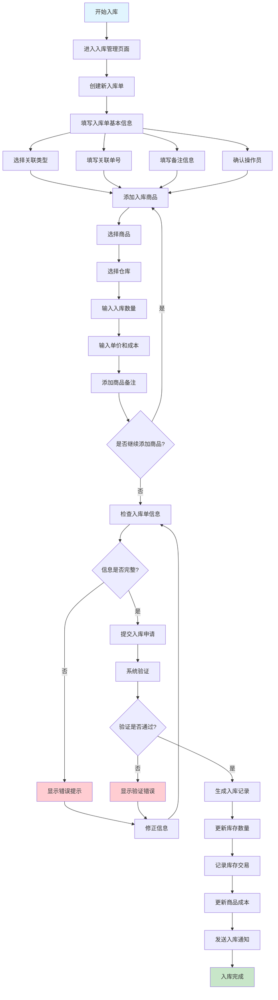
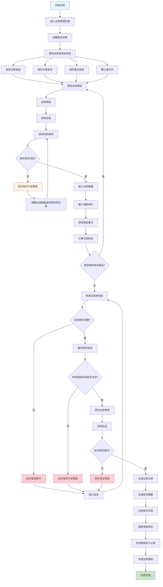
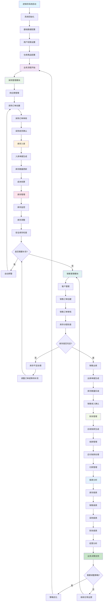
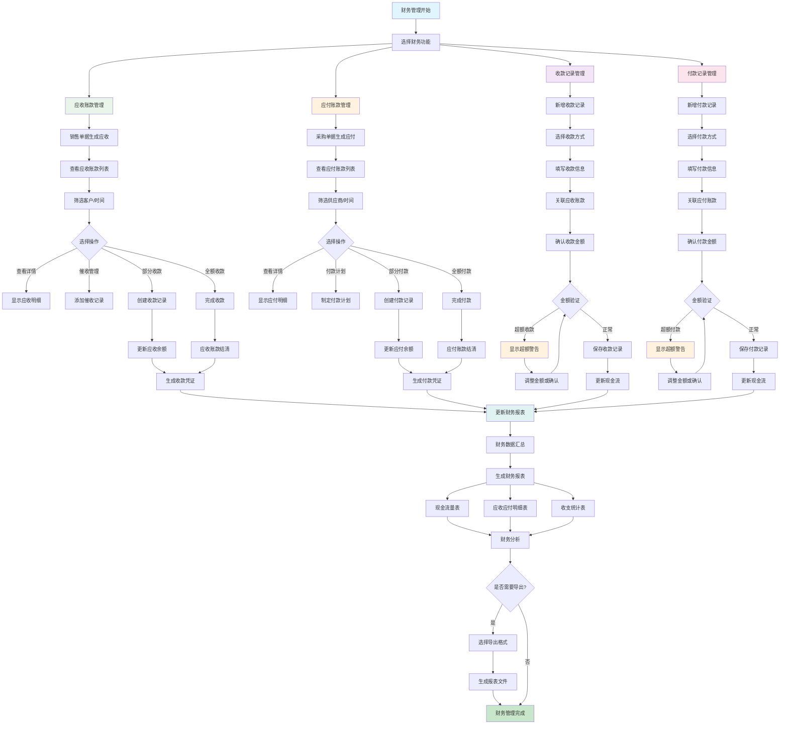
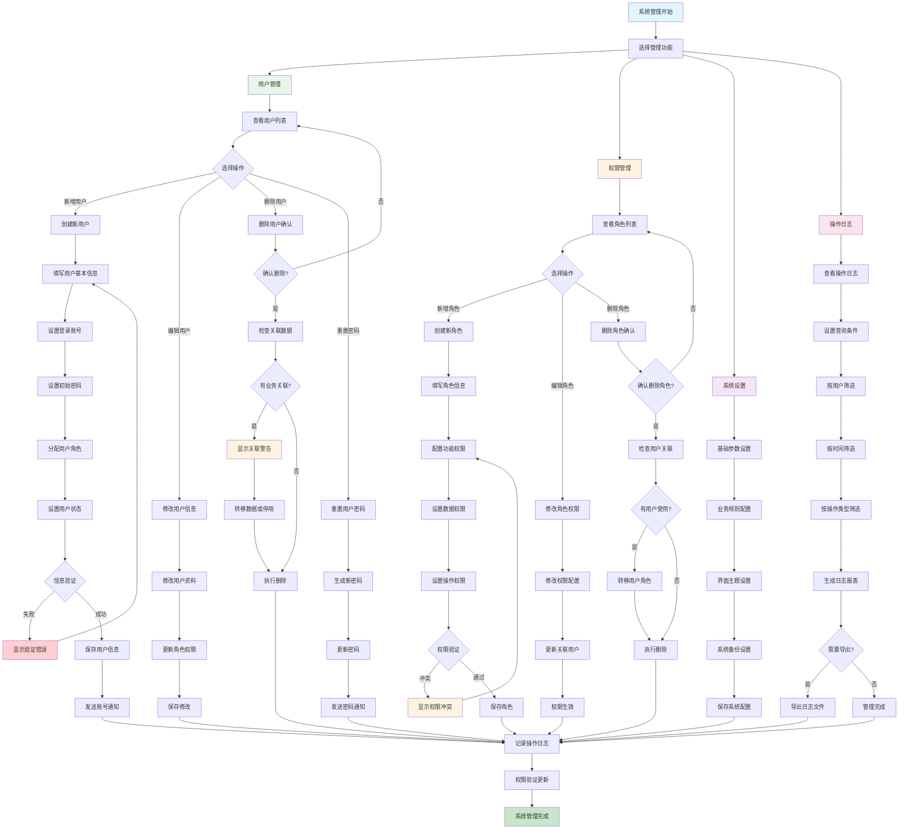
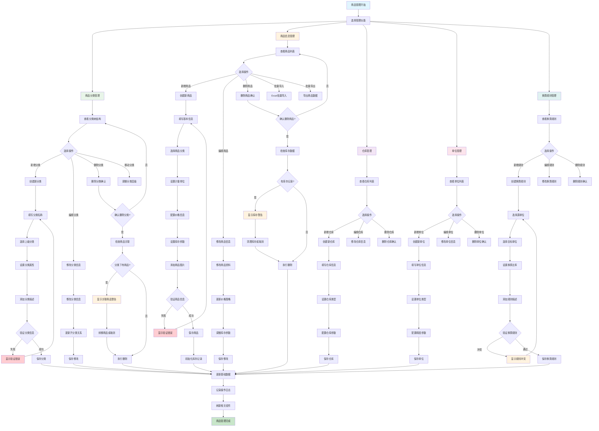
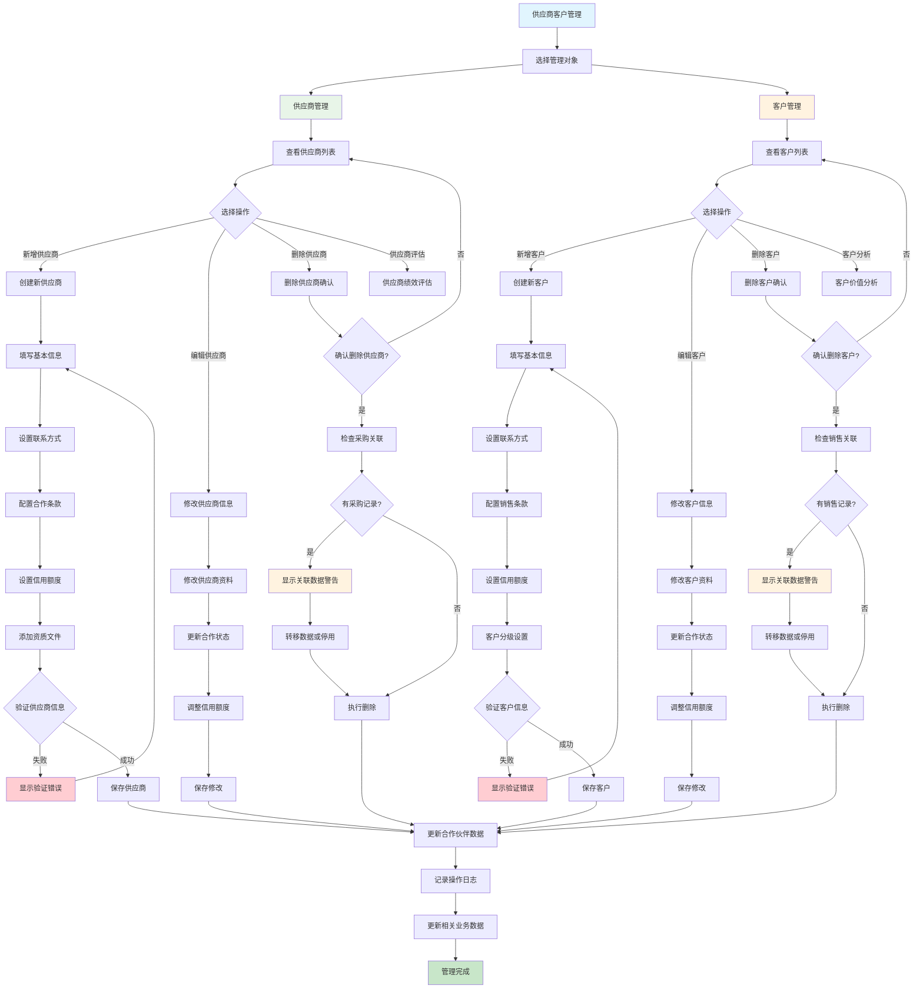
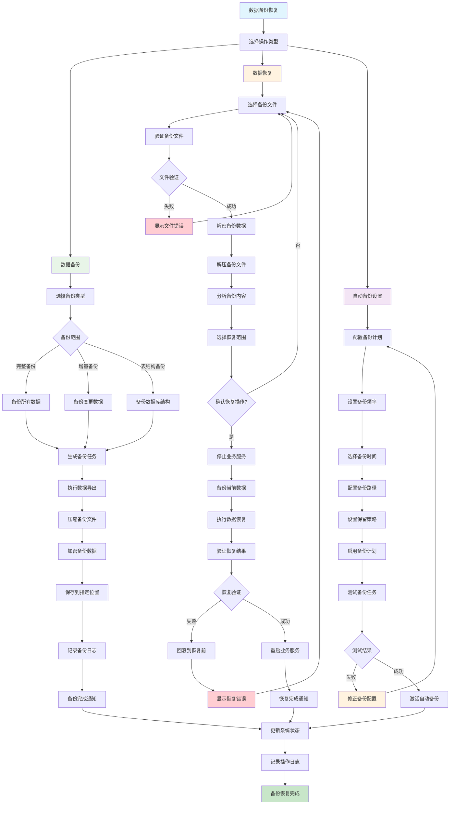

# 进销存管理系统 - 业务流程图集

> 本文档包含进销存管理系统所有核心业务流程的 Mermaid 流程图，用于理解系统架构和业务逻辑。

## 目录

1. [系统初始化流程图](#1-系统初始化流程图)
2. [入库流程图](#2-入库流程图)
3. [出库流程图](#3-出库流程图)
4. [进销存大流程图](#4-进销存大流程图整体业务流程)
5. [财务管理流程图](#5-财务管理流程图)
6. [用户权限管理流程图](#6-用户权限管理流程图)
7. [商品管理流程图](#7-商品管理流程图包含商品分类)
8. [供应商客户管理流程图](#8-供应商客户管理流程图)
9. [数据备份恢复流程图](#9-数据备份恢复流程图)

---

## 1. 系统初始化流程图

系统首次启动时的完整初始化流程，包含环境检查、数据库初始化、管理员设置、基础数据配置等关键步骤。

```mermaid
flowchart TD
    A[系统启动] --> B[检查系统环境]
    B --> C{首次启动?}
    
    C -->|是| D[进入系统初始化向导]
    C -->|否| E[验证系统完整性]
    
    %% 首次初始化流程
    D --> D1[欢迎页面]
    D1 --> D2[系统环境检查]
    D2 --> D3{环境检查通过?}
    D3 -->|否| D4[显示环境错误]
    D4 --> D5[修复环境问题]
    D5 --> D2
    
    D3 -->|是| D6[数据库初始化]
    D6 --> D7[创建数据库表结构]
    D7 --> D8[初始化基础数据]
    D8 --> D9[设置系统管理员]
    
    D9 --> D10[填写管理员信息]
    D10 --> D11[设置管理员密码]
    D11 --> D12[确认账号信息]
    D12 --> D13{信息验证}
    D13 -->|失败| D14[显示验证错误]
    D14 --> D10
    D13 -->|成功| D15[创建管理员账号]
    
    D15 --> D16[企业信息配置]
    D16 --> D17[填写企业基本信息]
    D17 --> D18[设置企业LOGO]
    D18 --> D19[配置业务参数]
    D19 --> D20[选择业务模块]
    
    D20 --> D21[基础数据初始化]
    D21 --> D22[创建默认商品分类]
    D22 --> D23[创建默认仓库]
    D23 --> D24[创建默认计量单位]
    D24 --> D25[设置默认换算规则]
    
    D25 --> D26[系统参数配置]
    D26 --> D27[库存预警设置]
    D27 --> D28[财务参数配置]
    D28 --> D29[报表模板设置]
    D29 --> D30[权限角色初始化]
    
    D30 --> D31[数据导入选项]
    D31 --> D32{是否导入历史数据?}
    D32 -->|是| D33[选择导入方式]
    D33 --> D34[Excel模板下载]
    D34 --> D35[数据格式验证]
    D35 --> D36{数据格式正确?}
    D36 -->|否| D37[显示格式错误]
    D37 --> D35
    D36 -->|是| D38[执行数据导入]
    D38 --> D39[验证导入结果]
    
    D32 -->|否| D40[跳过数据导入]
    D39 --> D40
    
    D40 --> D41[系统配置验证]
    D41 --> D42{配置完整性检查}
    D42 -->|失败| D43[显示配置错误]
    D43 --> D44[修正配置]
    D44 --> D41
    
    D42 -->|成功| D45[生成系统配置文件]
    D45 --> D46[初始化完成]
    D46 --> F[进入系统主界面]
    
    %% 非首次启动流程
    E --> E1[检查数据库连接]
    E1 --> E2{数据库连接成功?}
    E2 -->|否| E3[显示数据库错误]
    E3 --> E4[尝试重新连接]
    E4 --> E1
    
    E2 -->|是| E5[检查数据表完整性]
    E5 --> E6{数据表完整?}
    E6 -->|否| E7[修复数据表]
    E7 --> E8[数据迁移]
    E8 --> E5
    
    E6 -->|是| E9[加载系统配置]
    E9 --> E10[初始化业务服务]
    E10 --> E11[验证用户权限]
    E11 --> E12[加载缓存数据]
    E12 --> E13{系统自检通过?}
    
    E13 -->|否| E14[显示系统错误]
    E14 --> E15[进入安全模式]
    E15 --> E16[系统诊断]
    E16 --> E17[修复系统问题]
    E17 --> E13
    
    E13 -->|是| E18[系统启动完成]
    E18 --> F
    
    %% 系统主界面
    F --> F1[显示登录界面]
    F1 --> F2[用户身份验证]
    F2 --> F3{登录验证}
    F3 -->|失败| F4[显示登录错误]
    F4 --> F1
    F3 -->|成功| F5[加载用户权限]
    F5 --> F6[初始化用户界面]
    F6 --> F7[显示仪表盘]
    F7 --> G[系统正常运行]
    
    %% 错误处理和维护
    H[系统维护模式] --> H1[备份系统数据]
    H1 --> H2[清理临时文件]
    H2 --> H3[优化数据库]
    H3 --> H4[更新系统配置]
    H4 --> H5[重启系统服务]
    H5 --> E
    
    style A fill:#e1f5fe
    style D fill:#f3e5f5
    style E fill:#fff3e0
    style F fill:#e8f5e8
    style G fill:#c8e6c9
    style D4 fill:#ffcdd2
    style D14 fill:#ffcdd2
    style D37 fill:#ffcdd2
    style D43 fill:#ffcdd2
    style E3 fill:#ffcdd2
    style E14 fill:#ffcdd2
    style F4 fill:#ffcdd2
    style H fill:#e0f2f1
```

---

## 2. 入库流程图

商品入库的完整业务流程，从创建入库单到库存更新的所有操作步骤。

---

## 3. 出库流程图

商品出库的完整业务流程，包含库存检查、出库确认等关键控制环节。

---

## 4. 进销存大流程图（整体业务流程）

展示进销存系统完整的业务闭环，从采购管理到销售管理的全流程概览。

---

## 5. 财务管理流程图

财务模块的核心业务流程，包含应收应付账款管理、收付款记录、财务报表生成等功能。

---

## 6. 用户权限管理流程图

系统管理模块的核心流程，包含用户管理、权限配置、系统设置等功能。

---

## 7. 商品管理流程图（包含商品分类）

基础数据管理的核心流程，包含商品分类、商品信息、仓库管理、单位管理等功能。

---

## 8. 供应商客户管理流程图

合作伙伴管理流程，包含供应商管理和客户管理的完整操作流程。

---

## 9. 数据备份恢复流程图

系统数据安全管理流程，包含数据备份、恢复和自动备份设置功能。

---

## 流程图说明

### 颜色编码说明
- 🔵 **蓝色** (`#e1f5fe`): 流程开始节点
- 🟢 **绿色** (`#c8e6c9`): 流程结束/完成节点
- 🔴 **红色** (`#ffcdd2`): 错误处理节点
- 🟡 **黄色** (`#fff3e0`): 警告提示节点
- 🟣 **紫色** (`#f3e5f5`): 重要业务节点
- 🟨 **浅色系**: 不同功能模块区分

### 使用说明
1. 所有流程图使用 Mermaid 语法编写，可在支持 Mermaid 的平台直接渲染
2. 流程图展示了系统的主要业务逻辑和决策点
3. 错误处理和异常情况都有明确的处理路径
4. 可根据实际业务需求调整流程步骤

### 维护说明
- 当业务流程发生变更时，需要相应更新流程图
- 新增功能模块时，应补充对应的流程图
- 建议定期review流程图与实际代码实现的一致性

---

*文档生成时间: 2025-01-14*  
*版本: v1.0*  
*维护人员: 系统开发团队*