# 报表管理系统 - 详细流程图

> 本文档专门针对报表分析模块的所有业务流程，包含库存报表、销售报表、采购报表、财务报表以及综合分析报表的生成、查看、导出流程。

## 目录

1. [报表管理主流程图](#1-报表管理主流程图)
2. [库存报表流程图](#2-库存报表流程图)
3. [销售报表流程图](#3-销售报表流程图)
4. [采购报表流程图](#4-采购报表流程图)
5. [财务报表流程图](#5-财务报表流程图)
6. [出入库汇总报表流程图](#6-出入库汇总报表流程图)
7. [库存分析视图流程图](#7-库存分析视图流程图)
8. [日历视图报表流程图](#8-日历视图报表流程图)
9. [逐日消耗分析流程图](#9-逐日消耗分析流程图)
10. [报表导出与分享流程图](#10-报表导出与分享流程图)
11. [自定义报表流程图](#11-自定义报表流程图)

---

## 1. 报表管理主流程图

报表分析模块的总体业务流程概览，展示各报表类型和分析功能。

```mermaid
flowchart TD
    A[报表分析中心] --> B[选择报表类型]
    
    B --> C[库存报表]
    B --> D[销售报表]
    B --> E[采购报表]
    B --> F[财务报表]
    B --> G[综合分析]
    B --> H[自定义报表]
    
    %% 库存报表分支
    C --> C1[库存明细报表]
    C --> C2[库存汇总报表]
    C --> C3[出入库统计]
    C --> C4[库存流水账]
    C --> C5[ABC分析]
    C --> C6[库存周转分析]
    C --> C7[库存龄期分析]
    
    %% 销售报表分支
    D --> D1[销售明细报表]
    D --> D2[销售汇总报表]
    D --> D3[客户销售统计]
    D --> D4[商品销售排行]
    D --> D5[销售趋势分析]
    D --> D6[销售员业绩]
    D --> D7[客户分析报表]
    
    %% 采购报表分支
    E --> E1[采购明细报表]
    E --> E2[采购汇总报表]
    E --> E3[供应商采购统计]
    E --> E4[采购价格分析]
    E --> E5[采购计划执行]
    E --> E6[供应商绩效]
    E --> E7[采购成本分析]
    
    %% 财务报表分支
    F --> F1[应收账款报表]
    F --> F2[应付账款报表]
    F --> F3[收支明细报表]
    F --> F4[现金流量表]
    F --> F5[利润分析表]
    F --> F6[财务汇总表]
    F --> F7[财务比率分析]
    
    %% 综合分析分支
    G --> G1[经营数据看板]
    G --> G2[业务趋势分析]
    G --> G3[KPI指标分析]
    G --> G4[对比分析报表]
    G --> G5[预测分析报表]
    
    %% 自定义报表分支
    H --> H1[报表设计器]
    H --> H2[模板管理]
    H --> H3[数据源配置]
    H --> H4[计算字段设置]
    
    %% 报表处理流程
    C1 --> I[报表参数设置]
    C2 --> I
    C3 --> I
    C4 --> I
    C5 --> I
    C6 --> I
    C7 --> I
    D1 --> I
    D2 --> I
    D3 --> I
    D4 --> I
    D5 --> I
    D6 --> I
    D7 --> I
    E1 --> I
    E2 --> I
    E3 --> I
    E4 --> I
    E5 --> I
    E6 --> I
    E7 --> I
    F1 --> I
    F2 --> I
    F3 --> I
    F4 --> I
    F5 --> I
    F6 --> I
    F7 --> I
    G1 --> I
    G2 --> I
    G3 --> I
    G4 --> I
    G5 --> I
    
    I --> J[数据查询与计算]
    J --> K[报表生成与展示]
    K --> L[报表操作]
    
    L --> L1[查看详情]
    L --> L2[导出报表]
    L --> L3[打印报表]
    L --> L4[分享报表]
    L --> L5[保存模板]
    
    style A fill:#e1f5fe
    style I fill:#e8f5e8
    style J fill:#fff3e0
    style K fill:#f3e5f5
    style L fill:#c8e6c9
```

---

## 2. 库存报表流程图

详细的库存相关报表生成和分析流程。

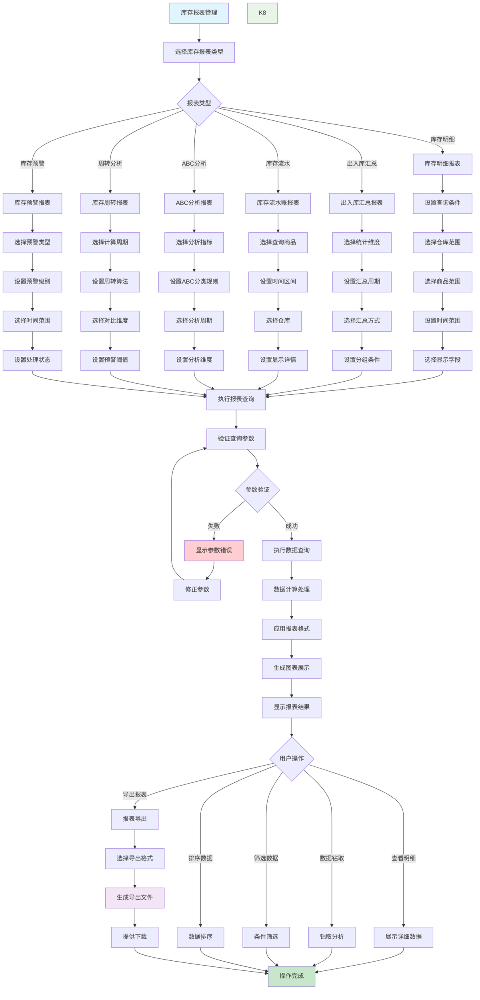

---

## 3. 销售报表流程图

销售业务相关报表的生成和分析流程。

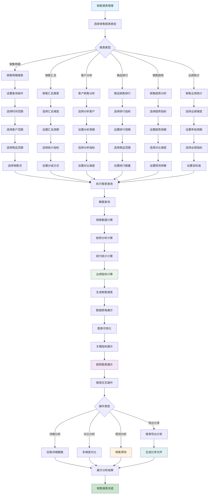

---

## 4. 采购报表流程图

采购业务相关报表的生成和分析流程。

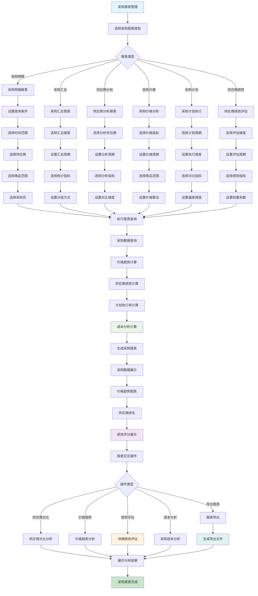

---

## 5. 财务报表流程图

财务相关报表的生成和分析流程。

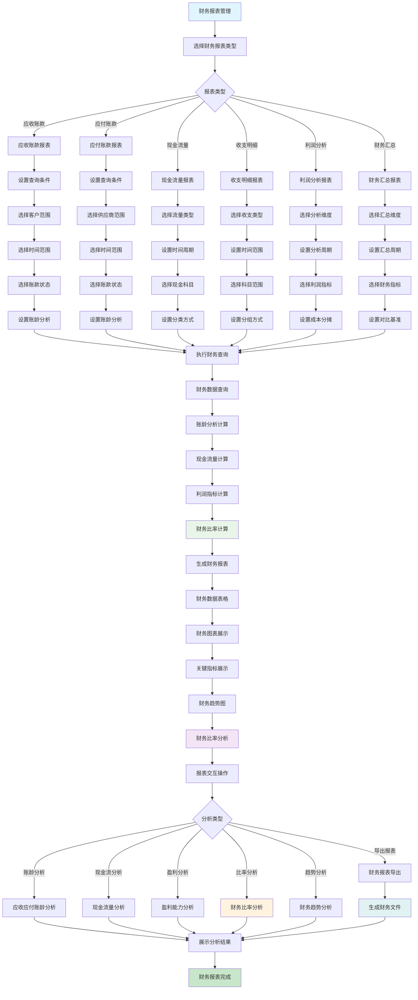

---

## 6. 出入库汇总报表流程图

出入库业务的汇总统计报表流程。

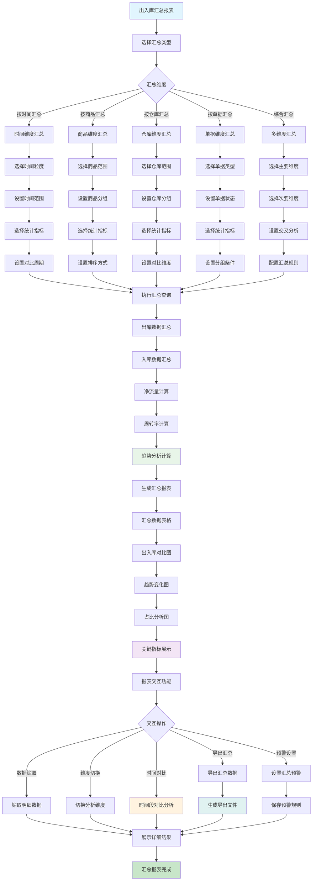

---

## 7. 库存分析视图流程图

库存卡片视图和深度分析的流程。

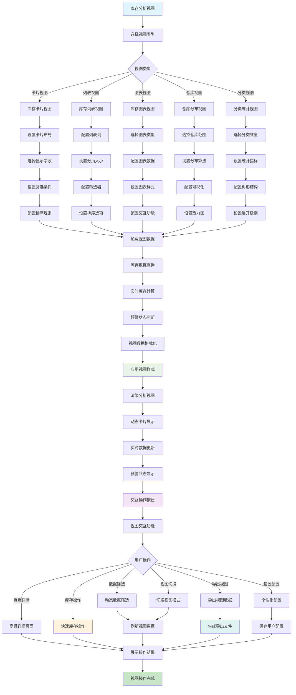

---

## 8. 日历视图报表流程图

基于日历的业务数据可视化分析流程。

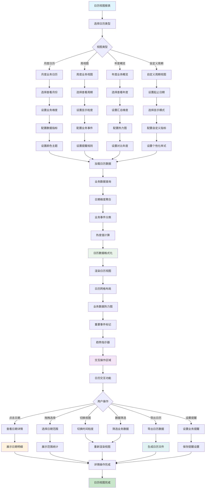

---

## 9. 逐日消耗分析流程图

逐日业务消耗数据的详细分析流程。

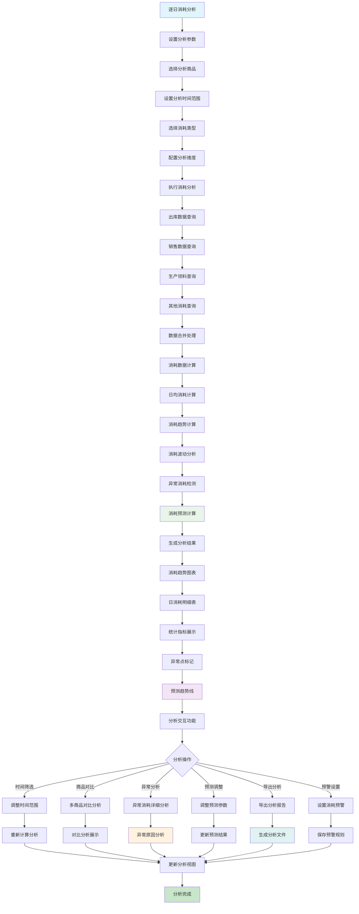

---

## 10. 报表导出与分享流程图

报表的导出、分享和协作流程。

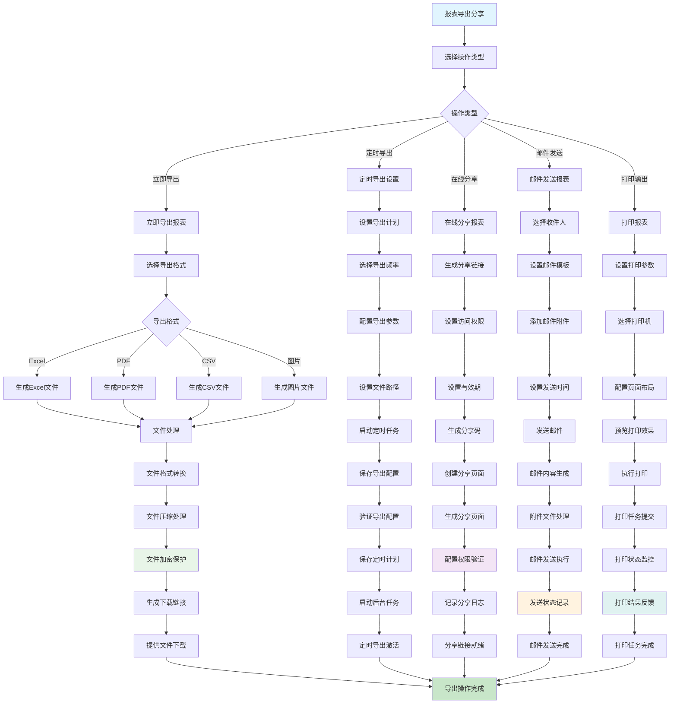

---

## 11. 自定义报表流程图

自定义报表设计和配置的流程。

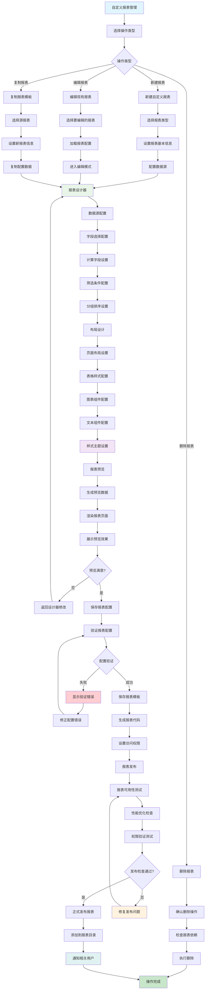

---

## 报表流程图使用说明

### 业务特点

1. **多维度报表体系**
   - 覆盖库存、销售、采购、财务等核心业务
   - 支持明细、汇总、分析等多种报表类型
   - 提供实时和历史数据的对比分析

2. **灵活的视图展示**
   - 卡片视图、列表视图、图表视图等多种展示方式
   - 日历视图和时间轴分析
   - 交互式数据钻取和筛选

3. **强大的导出分享功能**
   - 多格式导出（Excel、PDF、CSV等）
   - 在线分享和协作
   - 定时导出和邮件发送

4. **自定义报表设计**
   - 可视化报表设计器
   - 灵活的数据源配置
   - 丰富的样式和布局选项

### 颜色编码说明
- 🔵 **蓝色** (`#e1f5fe`): 流程开始节点
- 🟢 **绿色** (`#c8e6c9`): 流程结束/完成节点
- 🔴 **红色** (`#ffcdd2`): 错误处理节点
- 🟡 **黄色** (`#fff3e0`): 警告提示/重要决策节点
- 🟣 **紫色** (`#f3e5f5`): 重要数据处理节点
- 🟨 **绿色系** (`#e8f5e8`): 计算分析节点
- 🟦 **蓝绿色** (`#e0f2f1`): 文件处理/导出节点

### 实施建议

1. **报表权限管理**
   - 建立完善的报表访问权限体系
   - 设置敏感数据的脱敏规则
   - 实施报表使用审计机制

2. **性能优化**
   - 大数据量报表采用分页和缓存策略
   - 预计算常用的汇总指标
   - 优化数据库查询性能

3. **用户体验**
   - 提供报表使用培训和文档
   - 建立报表模板库和最佳实践
   - 收集用户反馈持续优化

---

*文档生成时间: 2025-01-14*  
*版本: v1.0*  
*维护人员: 报表开发团队*