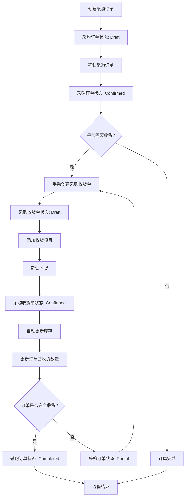
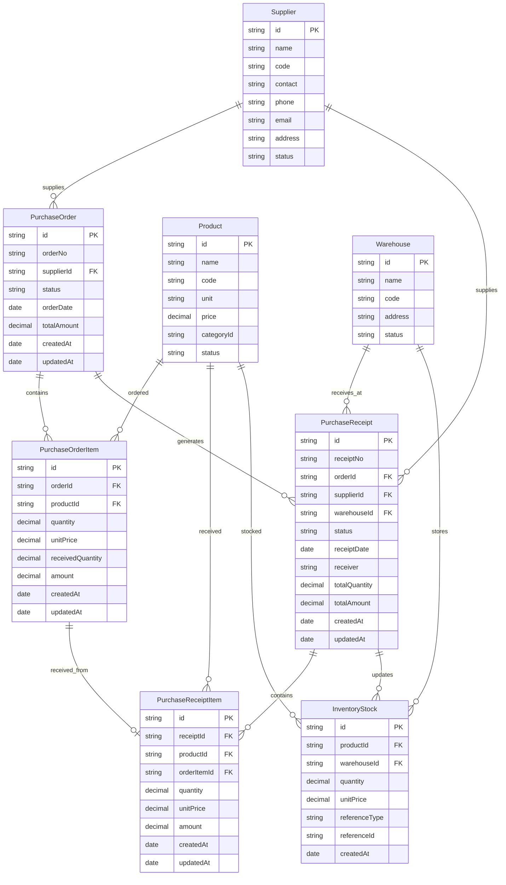
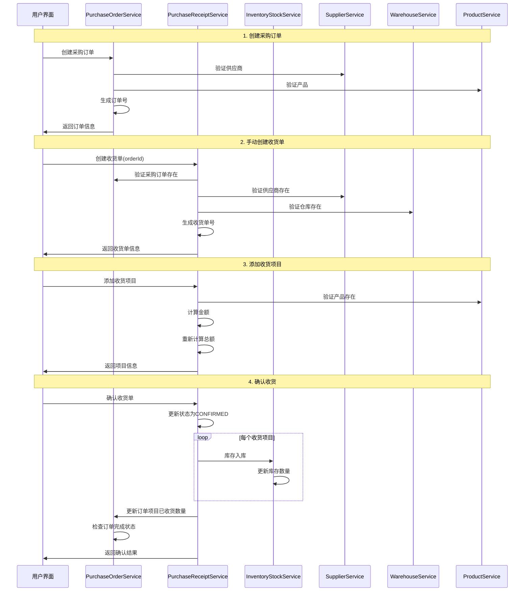
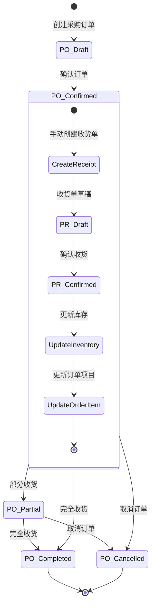

# 采购订单和采购收货关系流程图

## 整体业务流程

## 数据关系图

## 服务层交互流程

## 状态转换图

## 关键业务规则

### 1. 创建规则
- 采购收货单必须关联现有的采购订单
- 收货单创建时不会自动生成，需要手动触发
- 一个采购订单可以对应多个收货单（分批收货）

### 2. 收货规则
- 收货数量不能超过订单数量减去已收货数量
- 收货单确认后才会更新库存
- 收货单确认是原子操作，失败会回滚

### 3. 库存更新规则
- 只有确认状态的收货单才会更新库存
- 库存更新失败会回滚所有相关操作
- 库存更新成功后会更新订单项目的已收货数量

### 4. 订单状态规则
- Confirmed: 订单已确认，等待收货
- Partial: 部分收货，还有未收货项目
- Completed: 所有项目已完全收货