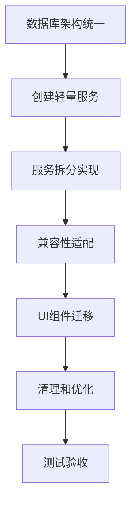

# 系统架构重构总体方案

## 📋 重构背景

基于对`待修复问题.md`文件第3项和第3.1项的深入分析，当前系统存在严重的过度工程化问题，需要进行全面的架构重构。

### 核心问题汇总

| 问题类别 | 具体问题 | 严重程度 | 影响范围 |
|---------|---------|---------|---------|
| **第3.1项** | InventoryService过度工程化 | 🔴 极高 | 整个库存管理模块 |
| **第3项** | 双重数据库架构重复 | 🟡 中高 | 数据一致性和维护 |
| **架构层级** | 7层架构过深 | 🟡 中 | 开发调试效率 |
| **依赖注入** | ServiceManager过度复杂 | 🟡 中 | 服务管理和初始化 |
| **缓存系统** | 10个Map缓存过度设计 | 🟡 中 | 内存使用和性能 |

## 🎯 重构目标

### 总体目标
遵循"单机版小型进销存，不要过度工程化"的项目定位，构建简洁、高效、易维护的轻量级架构。

### 具体目标
1. **统一数据库架构**：解决双重数据库问题
2. **简化服务层**：拆分巨型服务，移除复杂依赖注入
3. **减少架构层级**：从7层简化到4层
4. **移除过度缓存**：删除复杂缓存系统
5. **轻量化设计**：所有组件遵循简洁性原则

## 🏗️ 新架构设计

### 目标架构（4层）
```
UI组件层 → 业务服务层 → 数据访问层 → SQLite数据库
```

### 当前问题架构（7层）
```
UI组件 → Hook → ServiceManager → InventoryService → DatabaseManager → ElectronDatabase → IPC → SQLite
```

### 架构对比分析

| 层级 | 当前架构 | 新架构 | 改进说明 |
|------|---------|-------|---------|
| 1 | UI组件 | UI组件 | 保持不变 |
| 2 | Hook | 业务服务 | 简化Hook逻辑 |
| 3 | ServiceManager | - | 移除复杂DI |
| 4 | InventoryService | - | 拆分为多个小服务 |
| 5 | DatabaseManager | - | 移除中间抽象 |
| 6 | ElectronDatabase | 数据访问层 | 简化为直接IPC |
| 7 | IPC + SQLite | SQLite数据库 | 统一数据库文件 |

## 📊 重构范围详情

### 1. 数据库架构统一（解决第3项问题）

#### 当前问题
- **三个数据库文件**：根目录、data目录、用户配置目录
- **双重访问路径**：Electron主进程 + React渲染进程
- **数据不一致风险**：多个数据源可能不同步

#### 解决方案
```
统一架构：React组件 → IPC → Electron主进程 → 单一SQLite文件
```

**实施步骤**：
1. 统一数据库文件为 `data/inventory.db`
2. 删除 `src/services/database/` 目录
3. 所有数据操作通过IPC进行
4. 更新 `check_db.js` 指向统一位置

### 2. InventoryService拆分（解决第3.1项核心问题）

#### 当前问题
- **1613行巨型类**：违反单一职责原则
- **53个方法**：功能过于集中
- **10个Map缓存**：过度设计的缓存系统
- **8个职责混合**：产品、分类、单位、仓库、库存、交易、缓存、批量操作

#### 细化拆分方案（基于深度分析）

**原方案问题**：过度拆分导致服务间耦合高，事务处理复杂

**优化方案**：采用领域驱动设计，按业务领域拆分
```
InventoryService (1613行) → 3个领域服务 (150-400行/个)
```

| 新服务 | 职责 | 预估行数 | 核心功能 |
|-------|------|---------|---------|
| InventoryDomainService | 库存领域核心 | 400行 | 产品+库存一体化管理，事务处理 |
| MasterDataService | 基础数据管理 | 200行 | 分类、单位、仓库等基础数据 |
| ReportService | 报表统计服务 | 150行 | 统计信息、报表数据、预警 |

**优势**：
- 符合进销存集成业务特点
- 降低服务间耦合
- 简化事务处理
- 保持数据一致性

### 3. ServiceManager简化

#### 当前问题
- **复杂依赖注入**：企业级DI容器
- **过度抽象**：Promise.all服务编排
- **初始化复杂**：多层异步初始化

#### 简化方案
```typescript
// 简化的服务管理器
export class SimpleServiceManager {
  private productService = new ProductService();
  private categoryService = new CategoryService();
  // ... 其他服务

  getProductService() { return this.productService; }
  getCategoryService() { return this.categoryService; }
  // ... 其他getter
}

export const serviceManager = new SimpleServiceManager();
```

### 4. 缓存系统移除

#### 当前问题
- **10个Map缓存**：products, categories, units, warehouses, stocks, transactions, indexes
- **LRU淘汰机制**：100+行复杂代码
- **内存泄漏风险**：缓存管理复杂

#### 解决方案
- **完全移除缓存**：直接查询数据库
- **简化数据访问**：SQLite查询性能对小型应用足够
- **减少内存占用**：无缓存管理开销

## 📅 整合实施计划

### 阶段一：基础架构重构（第1-3天）

#### 第1天：数据库架构统一
- [ ] 备份所有数据库文件
- [ ] 统一数据库文件为 `data/inventory.db`
- [ ] 删除冗余数据库文件和目录
- [ ] 更新配置文件和调试工具
- [ ] 验证数据库连接和基础操作

#### 第2天：创建领域服务基础
- [ ] 创建 `src/services/domain/` 目录结构
- [ ] 定义领域服务接口和类型
- [ ] 实现 InventoryDomainService 核心框架
- [ ] 实现基础的产品和库存查询功能
- [ ] 编写基础单元测试

#### 第3天：完善领域服务
- [ ] 实现 InventoryDomainService 的库存操作功能
- [ ] 实现 MasterDataService 基础数据管理
- [ ] 创建 DomainServiceManager
- [ ] 完善测试覆盖和集成测试

### 阶段二：核心服务完成（第4-6天）

#### 第4天：库存相关服务
- [ ] 实现 StockService
- [ ] 实现 TransactionService
- [ ] 集成测试所有服务

#### 第5天：兼容性适配
- [ ] 创建 ServiceManagerAdapter
- [ ] 实现向后兼容接口
- [ ] 更新 useInventory Hook

#### 第6天：UI组件迁移开始
- [ ] 更新 ProductManagement 组件
- [ ] 更新 StockIn/StockOut 组件
- [ ] 功能回归测试

### 阶段三：全面迁移和清理（第7-9天）

#### 第7天：剩余组件迁移
- [ ] 更新所有库存相关组件
- [ ] 更新报表组件
- [ ] 验证所有功能正常

#### 第8天：清理和优化
- [ ] 删除原 InventoryService
- [ ] 删除复杂 ServiceManager
- [ ] 删除 `src/services/database/` 目录
- [ ] 代码清理和优化

#### 第9天：测试和验收
- [ ] 全面功能测试
- [ ] 性能测试
- [ ] 用户验收测试
- [ ] 文档更新

## 🔗 任务依赖关系



### 关键依赖说明
1. **数据库统一** 必须先完成，为后续服务提供稳定基础
2. **服务拆分** 按依赖顺序：Product → Category/Unit/Warehouse → Stock → Transaction
3. **兼容性适配** 确保UI组件迁移过程中功能不中断
4. **清理工作** 必须在所有迁移完成后进行

## ⚠️ 风险控制措施

### 数据安全
- [ ] 每个阶段开始前完整备份数据库
- [ ] 使用独立分支进行重构
- [ ] 关键节点创建数据快照

### 功能保障
- [ ] 每个服务实现后立即测试
- [ ] 保持向后兼容直到迁移完成
- [ ] 准备快速回滚方案

### 进度控制
- [ ] 每日进度检查和风险评估
- [ ] 关键里程碑验收
- [ ] 及时调整计划和资源

## 📈 预期效果

### 架构简化效果
| 指标 | 重构前 | 重构后 | 改善程度 |
|------|-------|-------|---------|
| 架构层级 | 7层 | 4层 | 减少43% |
| 服务类行数 | 1613行 | 200-300行 | 减少80% |
| 缓存数量 | 10个Map | 0个 | 减少100% |
| 数据库文件 | 3个 | 1个 | 减少67% |
| 学习成本 | 3-5天 | 1天内 | 减少70% |

### 维护性提升
- **代码可读性**：服务职责单一，逻辑清晰
- **调试效率**：架构简单，问题定位快速
- **扩展性**：新功能开发更容易
- **团队协作**：新人上手门槛低

## 🛠️ 技术实现细节

### 1. 数据库架构统一实现

#### 删除冗余文件和目录
```bash
# 删除重复的数据库文件
rm inventory.db  # 根目录
rm -rf ~/.config/inventory-management/  # 用户配置目录

# 删除冗余的数据库服务目录
rm -rf src/services/database/
```

#### 更新配置文件
```typescript
// src/config/database.ts
export const DATABASE_CONFIG = {
  // 统一数据库路径
  dbPath: path.join(app.getPath('userData'), 'data', 'inventory.db'),
  // 移除其他配置选项
};
```

#### 更新调试工具
```javascript
// check_db.js - 更新为统一路径
const dbPath = path.join(os.homedir(), 'AppData', 'Roaming', 'inventory-management', 'data', 'inventory.db');
```

### 2. 轻量服务实现模板

#### 服务基类模板
```typescript
// src/services/simple/BaseService.ts
export abstract class BaseService {
  protected async handleServiceCall<T>(
    operation: () => Promise<T>,
    errorMessage: string
  ): Promise<ServiceResult<T>> {
    try {
      const result = await operation();
      return { success: true, data: result };
    } catch (error) {
      return {
        success: false,
        error: error instanceof Error ? error.message : errorMessage
      };
    }
  }
}
```

#### 数据访问层统一接口
```typescript
// src/services/simple/DataAccess.ts
export class DataAccess {
  // 统一的IPC调用方法
  async query<T>(method: string, ...args: any[]): Promise<T> {
    return window.electronAPI[method](...args);
  }

  // 事务支持
  async transaction<T>(operations: (() => Promise<any>)[]): Promise<T[]> {
    return window.electronAPI.dbExecuteTransaction(operations);
  }
}
```

### 3. 组件迁移适配器

#### 临时兼容适配器
```typescript
// src/services/adapters/InventoryServiceAdapter.ts
export class InventoryServiceAdapter {
  private productService: ProductService;
  private categoryService: CategoryService;
  private stockService: StockService;

  constructor() {
    this.productService = serviceManager.getProductService();
    this.categoryService = serviceManager.getCategoryService();
    this.stockService = serviceManager.getStockService();
  }

  // 兼容原有接口
  async getProducts(filter?: any, pagination?: any) {
    return this.productService.getProducts(filter);
  }

  async getCategories() {
    return this.categoryService.getCategories();
  }

  // 逐步迁移，最终删除此适配器
}
```

### 4. 数据流向设计

#### 新架构数据流
```
用户操作 → UI组件 → 业务服务 → IPC调用 → Electron主进程 → SQLite
```

#### 错误处理流
```
SQLite错误 → Electron主进程 → IPC返回 → 业务服务 → UI组件 → 用户提示
```

## 📋 详细检查清单

### 阶段一检查清单（第1-3天）

#### 第1天：数据库统一
- [ ] 备份原有数据库文件
- [ ] 确认数据完整性
- [ ] 删除重复数据库文件
- [ ] 更新 `public/main.js` 数据库路径
- [ ] 更新 `check_db.js` 检查路径
- [ ] 验证应用启动正常
- [ ] 验证基础数据操作正常

#### 第2天：基础服务创建
- [ ] 创建目录结构 `src/services/simple/`
- [ ] 实现 `BaseService` 基类
- [ ] 实现 `DataAccess` 数据访问层
- [ ] 实现 `ProductService` 完整功能
- [ ] 创建 `SimpleServiceManager`
- [ ] 编写 `ProductService` 单元测试
- [ ] 验证产品CRUD操作正常

#### 第3天：扩展服务实现
- [ ] 实现 `CategoryService`
- [ ] 实现 `UnitService`
- [ ] 实现 `WarehouseService`
- [ ] 完善所有服务的单元测试
- [ ] 集成测试服务间协作
- [ ] 验证数据一致性

### 阶段二检查清单（第4-6天）

#### 第4天：库存服务
- [ ] 实现 `StockService` 完整功能
- [ ] 实现 `TransactionService`
- [ ] 验证库存更新逻辑正确
- [ ] 验证交易记录生成正确
- [ ] 集成测试所有服务
- [ ] 性能测试基础功能

#### 第5天：兼容性适配
- [ ] 创建 `InventoryServiceAdapter`
- [ ] 实现向后兼容接口
- [ ] 更新 `useInventory` Hook
- [ ] 验证Hook功能正常
- [ ] 测试适配器兼容性
- [ ] 准备组件迁移计划

#### 第6天：组件迁移开始
- [ ] 更新 `ProductManagement` 组件
- [ ] 更新 `StockIn` 组件
- [ ] 更新 `StockOut` 组件
- [ ] 功能回归测试
- [ ] 用户界面测试
- [ ] 错误处理验证

### 阶段三检查清单（第7-9天）

#### 第7天：全面组件迁移
- [ ] 更新所有库存相关组件
- [ ] 更新报表组件
- [ ] 更新仪表板组件
- [ ] 验证所有页面功能正常
- [ ] 验证数据显示正确
- [ ] 验证用户操作流程

#### 第8天：清理优化
- [ ] 删除原 `InventoryService.ts`
- [ ] 删除复杂 `ServiceManager.ts`
- [ ] 删除 `src/services/database/` 目录
- [ ] 删除临时适配器
- [ ] 代码格式化和优化
- [ ] 更新导入语句

#### 第9天：最终验收
- [ ] 全面功能测试
- [ ] 性能基准测试
- [ ] 内存使用测试
- [ ] 用户验收测试
- [ ] 文档更新完成
- [ ] 部署准备就绪

## 🚨 应急预案

### 数据恢复预案
1. **数据库损坏**：从备份恢复数据库文件
2. **数据丢失**：使用每日备份恢复
3. **迁移失败**：回滚到重构前版本

### 功能回滚预案
1. **服务异常**：启用适配器模式
2. **组件错误**：回滚到原组件版本
3. **系统崩溃**：完整回滚到重构前状态

### 进度延期预案
1. **技术难题**：调整实施顺序，优先核心功能
2. **测试不通过**：延长测试阶段，确保质量
3. **资源不足**：分阶段实施，降低风险

---

**文档版本**: v2.0
**最后更新**: 2025-07-13
**适用范围**: 系统整体架构重构
**相关文档**: InventoryService重构计划.md, 重构实施步骤详细指南.md, UI组件迁移指南.md
