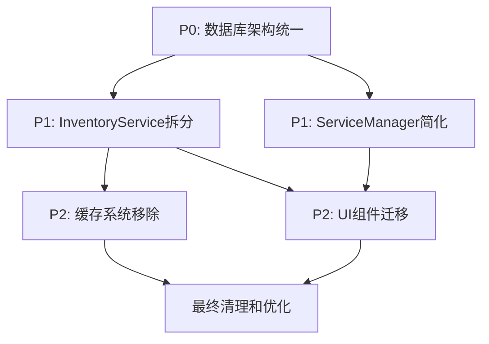

# 重构任务依赖关系和优先级管理

## 📋 任务概览

基于`待修复问题.md`第3项和第3.1项的整合分析，本文档明确各重构任务之间的依赖关系和优先级安排。

## 🎯 核心问题优先级

### 最高优先级（P0）- 必须首先解决
1. **数据库架构统一**（第3项问题）
   - 影响：所有后续开发的基础
   - 风险：数据不一致，开发环境不稳定
   - 依赖：无前置依赖

### 高优先级（P1）- 核心重构任务
2. **InventoryService拆分**（第3.1项核心问题）
   - 影响：整个库存管理模块
   - 风险：开发维护成本持续增加
   - 依赖：数据库架构统一完成

3. **ServiceManager简化**（第3.1项相关问题）
   - 影响：服务管理和依赖注入
   - 风险：初始化复杂，调试困难
   - 依赖：InventoryService拆分进行中

### 中优先级（P2）- 支撑性任务
4. **缓存系统移除**（第3.1项相关问题）
   - 影响：内存使用和性能
   - 风险：内存泄漏，维护复杂
   - 依赖：服务拆分完成

5. **UI组件迁移**
   - 影响：用户界面和交互
   - 风险：功能回归，用户体验下降
   - 依赖：新服务架构稳定

## 🔗 详细依赖关系图

## 📅 时间线和里程碑

### 第1天：P0任务 - 数据库架构统一
**里程碑：统一数据库基础**

#### 上午（4小时）
- [ ] 备份所有现有数据库文件
- [ ] 分析当前数据库文件分布
- [ ] 制定数据迁移计划

#### 下午（4小时）
- [ ] 统一数据库文件为 `data/inventory.db`
- [ ] 删除重复数据库文件
- [ ] 更新配置文件和路径引用
- [ ] 验证应用启动和基础功能

**验收标准**：
- [ ] 只存在一个数据库文件
- [ ] 应用正常启动
- [ ] 基础CRUD操作正常
- [ ] 数据完整性验证通过

### 第2天：P1任务开始 - 服务拆分基础
**里程碑：轻量服务架构建立**

#### 上午（4小时）
- [ ] 创建 `src/services/simple/` 目录结构
- [ ] 定义基础类型和接口
- [ ] 实现 BaseService 基类
- [ ] 实现 DataAccess 数据访问层

#### 下午（4小时）
- [ ] 实现 ProductService（250行，8个方法）
- [ ] 创建 SimpleServiceManager
- [ ] 编写 ProductService 单元测试
- [ ] 验证产品管理功能

**验收标准**：
- [ ] ProductService 功能完整
- [ ] 单元测试覆盖率 > 80%
- [ ] 产品CRUD操作正常
- [ ] 代码质量检查通过

### 第3天：P1任务继续 - 扩展服务实现
**里程碑：基础业务服务完成**

#### 上午（4小时）
- [ ] 实现 CategoryService（180行，6个方法）
- [ ] 实现 UnitService（120行，4个方法）
- [ ] 编写对应单元测试

#### 下午（4小时）
- [ ] 实现 WarehouseService（180行，6个方法）
- [ ] 集成测试所有基础服务
- [ ] 验证服务间协作正常

**验收标准**：
- [ ] 所有基础服务功能完整
- [ ] 服务间依赖关系正确
- [ ] 集成测试通过
- [ ] 性能基准测试通过

### 第4天：P1任务核心 - 库存服务实现
**里程碑：核心业务逻辑完成**

#### 上午（4小时）
- [ ] 实现 StockService（200行，8个方法）
- [ ] 实现库存更新和查询逻辑
- [ ] 处理库存事务和一致性

#### 下午（4小时）
- [ ] 实现 TransactionService（150行，5个方法）
- [ ] 实现库存交易记录管理
- [ ] 集成测试库存相关功能

**验收标准**：
- [ ] 库存更新逻辑正确
- [ ] 交易记录生成准确
- [ ] 数据一致性验证通过
- [ ] 并发操作测试通过

### 第5天：P1+P2任务 - 兼容性和迁移准备
**里程碑：迁移准备就绪**

#### 上午（4小时）
- [ ] 创建 InventoryServiceAdapter
- [ ] 实现向后兼容接口
- [ ] 简化 ServiceManager

#### 下午（4小时）
- [ ] 更新 useInventory Hook
- [ ] 验证Hook功能正常
- [ ] 准备组件迁移计划

**验收标准**：
- [ ] 适配器功能完整
- [ ] Hook迁移成功
- [ ] 向后兼容性验证通过
- [ ] 组件迁移计划就绪

### 第6-7天：P2任务 - UI组件迁移
**里程碑：用户界面迁移完成**

#### 第6天：核心组件迁移
- [ ] 更新 ProductManagement 组件
- [ ] 更新 StockIn/StockOut 组件
- [ ] 功能回归测试

#### 第7天：全面组件迁移
- [ ] 更新所有库存相关组件
- [ ] 更新报表和仪表板组件
- [ ] 用户界面测试

**验收标准**：
- [ ] 所有组件迁移完成
- [ ] 用户界面功能正常
- [ ] 用户体验无下降
- [ ] 错误处理正确

### 第8天：P2任务 - 清理和优化
**里程碑：架构清理完成**

#### 上午（4小时）
- [ ] 删除原 InventoryService.ts（1613行）
- [ ] 删除复杂 ServiceManager
- [ ] 删除缓存系统代码

#### 下午（4小时）
- [ ] 删除 `src/services/database/` 目录
- [ ] 代码清理和格式化
- [ ] 更新导入语句

**验收标准**：
- [ ] 原有复杂代码完全移除
- [ ] 代码结构清晰
- [ ] 导入依赖正确
- [ ] 构建无错误无警告

### 第9天：最终验收和部署准备
**里程碑：重构完成**

#### 上午（4小时）
- [ ] 全面功能测试
- [ ] 性能基准测试
- [ ] 内存使用测试

#### 下午（4小时）
- [ ] 用户验收测试
- [ ] 文档更新完成
- [ ] 部署准备就绪

**验收标准**：
- [ ] 所有功能测试通过
- [ ] 性能指标达标
- [ ] 用户验收通过
- [ ] 文档完整准确

## ⚠️ 关键风险点和应对措施

### 风险点1：数据库迁移失败（第1天）
**影响**：阻塞所有后续工作
**应对**：
- 完整数据备份
- 分步迁移验证
- 准备回滚方案

### 风险点2：服务拆分复杂度超预期（第2-4天）
**影响**：延期，质量下降
**应对**：
- 优先核心功能
- 简化非关键特性
- 增加测试覆盖

### 风险点3：UI组件迁移回归问题（第6-7天）
**影响**：用户体验下降
**应对**：
- 渐进式迁移
- 充分回归测试
- 保持向后兼容

### 风险点4：性能下降（第8-9天）
**影响**：系统可用性
**应对**：
- 性能基准对比
- 优化关键路径
- 必要时保留部分缓存

## 📊 进度跟踪指标

### 每日跟踪指标
- [ ] 计划任务完成率
- [ ] 代码质量指标（测试覆盖率、复杂度）
- [ ] 功能回归测试通过率
- [ ] 性能基准对比

### 里程碑验收指标
- [ ] 架构层级减少：7层 → 4层
- [ ] 代码行数减少：1613行 → 200-300行/服务
- [ ] 缓存数量减少：10个 → 0个
- [ ] 数据库文件统一：3个 → 1个

---

**文档版本**: v1.0  
**最后更新**: 2025-07-13  
**相关文档**: 系统架构重构总体方案.md, InventoryService重构计划.md
